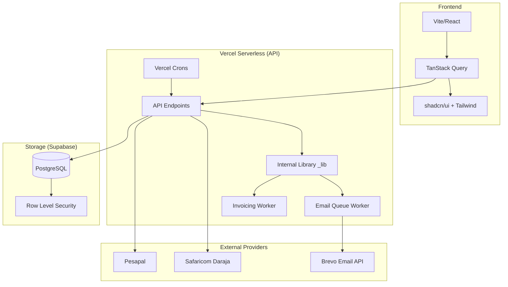

# 🏠 Landee & Moony - Rent Management System

A modern, full-stack property management platform built with **React**, **TypeScript**, **Vercel Serverless Functions**, and **Supabase**.

## ✨ Features

### 🔐 Authentication & Security
- **Multi-Auth**: Email/Password and Google OAuth login.
- **RBAC**: Multi-role support for **Landlords**, **Tenants**, and **Property Managers**.
- **Data Privacy**: Supabase Row-Level Security (RLS) ensures data isolation between users.

### 🏢 Core Management
- **Properties & Units**: Full CRUD for building portfolios, tracking unit amenities (bedrooms, size), and occupancy history.
- **Lease Agreements**: Digital lease tracking with start/end dates, automated status transitions (Active/Expired), and rental pricing.
- **Tenant Profiles**: Centralized database for contact info and emergency details.

### 💰 Financial Automation
- **Direct M-PESA STK Push**: Native Safaricom Daraja API integration for instant dashboard payments.
- **Automated Invoicing**: System-wide monthly invoice generation on the 1st of every month.
- **Pesapal Integration**: Support for card and mobile payments via the Pesapal gateway.
- **Revenue Analytics**: Real-time tracking of monthly revenue, collections, and outstanding balances.

### 📋 Operations & Notifications
- **Maintenance Requests**: Tenants can report issues; Landlords can track and update statuses.
- **Asynchronous Email Queue**: Background processing of payment receipts, rent reminders, and tenant invitations.
- **Vercel Cron Jobs**: Automated 24/7 background tasks for email processing and invoice generation.

---

## 🏗️ Architecture

---

## 🛠️ Technical Stack

- **Frontend**: React 18, Vite, TypeScript, Wouter (Routing), TanStack Query, Tailwind CSS, shadcn/ui.
- **Backend**: Vercel Serverless Functions (Node.js), postgres.js (Raw SQL for workers), Zod (Validation).
- **Database**: Supabase (PostgreSQL 15) with Session Pooling.
- **Providers**: Safaricom (Payments), Brevo (Emails), Google (OAuth).

---

## 🚀 Setup & Environment

### Essential Environment Variables
To get the system running, configure these in your Vercel/Local environment:

| Variable | Usage |
| :--- | :--- |
| `DATABASE_URL` | Supabase Postgres URL |
| `SUPABASE_URL` | API URL for Auth/Storage |
| `BREVO_API_KEY` | SMTP/Transactional Email provider |
| `MPESA_PASSKEY` | M-PESA Daraja Portal |
| `CRON_SECRET` | Secures the `/api/cron/*` endpoints |

### Database Provisioning
Run the SQL migrations in the Supabase SQL Editor:
1. `supabase-migration.sql` (Initial schema)
2. `CREATE TABLE public.email_queue` (Provided in deployment docs)

---

## 🗺️ Roadmap

### Phase 2: CRM & Engagement
- [ ] **SMS Integration**: Africa's Talking for mobile rent reminders.
- [ ] **Document Management**: Uploading signed lease PDFs to Supabase Storage.
- [ ] **WhatsApp Bot**: Self-service balance checks via WhatsApp.

### Phase 3: Advanced Accounting
- [ ] **Lending & Late Fees**: Automatic penalty application for overdue rent.
- [ ] **Financial Exports**: PDF/CSV exports for tax filing and audits.
- [ ] **Utility Tracking**: Water and electricity billing per unit.

---

Built & Maintained by Dennis Muchai. 🚀
[Live Dashboard](https://property-manager-ke.vercel.app)